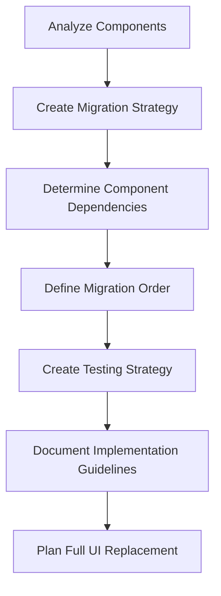
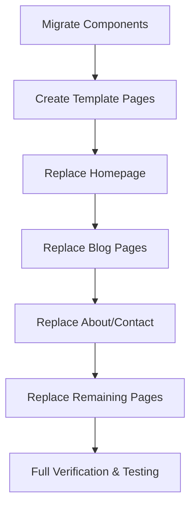

# React Component Migration Plan for astro-starter Project

## 1. Overview

This document outlines a comprehensive plan for migrating React components from the main-theme project to the astro-starter project. The goal is to create a systematic approach that developers can follow to ensure a smooth and efficient migration process.

## 2. Component-by-Component Analysis

Based on a detailed examination of both the astro-starter components and the main-theme React components, here is a comprehensive analysis of each component:

| Component | Purpose & Functionality | Existing Astro Equivalent | Migration Decision | Justification | Hydration Strategy |
|-----------|-------------------------|---------------------------|-------------------|---------------|-------------------|
| Navigation | Site navigation with mobile menu | Yes - More feature-rich with accessibility features | Keep Astro version | Astro version has better accessibility features, dropdown functionality, and keyboard navigation | N/A |
| Hero | Main landing section with title and CTA | Yes - Similar layout but different styling | Keep Astro version | Mostly static content with no complex interactivity | N/A |
| Blog | Blog listing with category filtering | No equivalent found | Use React component | Has interactive filtering functionality using React state | client:visible - Only hydrates when scrolled into view |
| BlogPost | Individual blog post display | No direct equivalent | Use React component | Uses dangerouslySetInnerHTML and works with BlogPostCard | client:load - Content is important for SEO |
| BlogPostCard | Card component for blog listings | No direct equivalent | Use React component | Works with Blog component for filtering | Used within Blog component |
| Footer | Site footer with copyright | Yes - Similar structure | Keep Astro version | Simple static component, Astro version integrates with site design | N/A |
| About | Company information section | No direct equivalent | Convert to Astro | Static content with no interactivity | N/A |
| Services | Service listings | No direct equivalent | Convert to Astro | Static content with basic mapping, no complex interactivity | N/A |
| Contact | Contact information display | No direct equivalent | Convert to Astro | Static content with no form functionality | N/A |
| Gallery | Image gallery display | No direct equivalent | Convert to Astro with option for React enhancement | Currently static, but could benefit from React if lightbox/slider needed | Optional: client:visible |

## 3. Migration Process Documentation

For each type of migration approach, the following processes should be followed:

### 3.1. Keeping Existing Astro Components (Navigation, Hero, Footer)

**Process**:
- Verify the existing Astro component meets all functional requirements
- Update styling if needed to match main-theme design system
- Ensure any content differences are addressed

**Code Structure**:
- Keep the existing file structure in `src/components/`
- Maintain Astro's component structure with frontmatter and HTML template

### 3.2. Using React Components (Blog, BlogPost, BlogPostCard)

**Process**:
- Create corresponding files in `src/components/react/`
- Copy the component code from main-theme
- Adapt imports to match astro-starter project structure
- Update any styling to use the astro-starter design system
- Integrate with Astro pages using the appropriate client directive

**Code Structure**:
- Place components in `src/components/react/`
- Add to index.ts export file if needed
- Update any component dependencies (icons, etc.)

**State Management**:
- Keep local component state for UI interactions
- For the Blog component's category filtering:
  - Maintain the useState hook for tracking the active category
  - Ensure the filtering logic stays within the component
  - Consider adding a custom hook (e.g., `useCategories`) if the logic becomes more complex

**Accessibility**:
- Ensure all interactive elements have proper ARIA attributes
- Verify keyboard navigation works correctly
- Test with screen readers

### 3.3. Converting React to Astro (About, Services, Contact, Gallery)

**Process**:
- Create new Astro component files
- Convert JSX syntax to Astro's HTML-like syntax
- Move React imports to Astro frontmatter
- Replace React-specific patterns with Astro equivalents

**Code Structure**:
- Place in `src/components/`
- Follow Astro component patterns for mapping arrays and conditional rendering

**Accessibility**:
- Maintain all accessibility features from original components
- Enhance if needed to match existing Astro components' standards

## 4. Migration Order

The following migration order is recommended based on dependencies and complexity:

### Phase 1: Blog Components Ecosystem (High Priority)
- BlogPostCard (dependency for Blog component)
- BlogPost (uses similar styling as BlogPostCard)
- Blog (main component with filtering functionality)
- These form a connected system with the most complex functionality and should be migrated together first

### Phase 2: Simple Static Components
- About
- Services
- Contact
- These are independent components with static content that can be converted to Astro relatively easily

### Phase 3: Gallery Component
- Initially as a static Astro component
- Optionally enhance with React if interactive features are needed

### Phase 4: Integration Verification
- Verify all components work together properly
- Test navigation between pages
- Ensure consistent styling across components

## 5. Testing Strategy

For each migrated component, the following testing approach should be implemented:

### 5.1. Visual Testing
- Compare rendered output with original component
- Verify styling matches design system
- Test across different viewport sizes (mobile, tablet, desktop)

### 5.2. Functional Testing
- Verify all interactive elements work as expected
- Test category filtering in Blog component
- Ensure navigation works correctly

### 5.3. Accessibility Testing
- Verify keyboard navigation
- Test with screen readers
- Check for appropriate ARIA attributes
- Ensure color contrast meets WCAG standards

### 5.4. Performance Testing
- Measure hydration times for React components
- Compare bundle sizes
- Verify correct client directive usage for optimal loading

### 5.5. Integration Testing
- Test React components within Astro pages
- Verify props are correctly passed from Astro to React
- Ensure hydration strategies are working as expected
- Test navigation between pages with React components

### 5.6. Specific Test Cases
- Navigation: Test dropdown menus, mobile responsiveness, and keyboard navigation
- Blog: Test category filtering works correctly
- BlogPost: Test content rendering with HTML
- Gallery: Test responsive layout and image loading

## 6. Implementation Guidelines

For developers implementing this migration plan:

### 6.1. Component Structure
- Use TypeScript for all components
- Follow existing project patterns for props and interfaces
- Maintain consistent naming conventions

### 6.2. Styling
- Use the existing Tailwind classes
- Maintain design consistency with existing components
- Consider creating shared style tokens for colors, spacing, etc.

### 6.3. Accessibility
- Follow WCAG 2.1 AA standards
- Ensure keyboard navigation for all interactive elements
- Maintain proper heading hierarchy
- Use semantic HTML elements

### 6.4. Code Quality
- Write clean, maintainable code
- Add JSDoc comments for components and props
- Follow project linting rules

### 6.5. Performance
- Choose appropriate hydration strategies
- Optimize images and assets
- Minimize unnecessary re-renders in React components

## 7. Risk Assessment and Mitigation Strategies

During component migration and UI replacement, several potential risks may arise. This section outlines those risks and provides strategies for mitigating them.

### 7.1. Technical Risks

| Risk | Potential Impact | Mitigation Strategy |
|------|-----------------|---------------------|
| Hydration mismatch between server and client | Component rendering errors, broken functionality | Use strict TypeScript typing, implement proper prop validation, add comprehensive testing for hydration |
| Style inconsistencies between Astro and React components | Visual inconsistencies, poor user experience | Create shared design tokens, implement design system documentation, use utility classes consistently |
| Performance degradation due to improper React hydration | Slower page loads, poor user experience | Benchmark performance before and after migration, use appropriate client directives, implement code splitting |
| Browser compatibility issues | Functionality breaks in certain browsers | Implement cross-browser testing, use appropriate polyfills, verify in multiple browsers |
| TypeScript/type errors during migration | Development delays, potential runtime errors | Set up strict TypeScript checking, create proper interfaces for all components, implement CI checks |

### 7.2. Process Risks

| Risk | Potential Impact | Mitigation Strategy |
|------|-----------------|---------------------|
| Scope creep during component migration | Schedule delays, inconsistent implementation | Clearly define component boundaries, implement strict code review process, maintain detailed migration documentation |
| Knowledge gaps about component functionality | Implementation errors, missing features | Document component behavior before migration, perform paired programming for complex components, implement thorough testing |
| Integration issues between components | Broken user flows, functionality gaps | Create integration test suite, implement staged testing approach, clearly define component APIs |
| Loss of accessibility features | Reduced accessibility, potential compliance issues | Establish accessibility requirements upfront, include a11y testing in CI/CD, perform manual accessibility audits |
| Content migration errors | Missing or incorrect content | Create content inventory, implement content verification process, develop automated content testing |

### 7.3. Organizational Risks

| Risk | Potential Impact | Mitigation Strategy |
|------|-----------------|---------------------|
| Team unfamiliarity with Astro-React integration | Development delays, implementation errors | Provide training on Astro-React integration, create detailed documentation, set up mentoring for less experienced developers |
| Competing priorities affecting migration | Schedule delays, inconsistent implementation | Establish clear migration milestones, secure dedicated time for migration work, implement progress tracking |
| Lack of testing resources | Undiscovered bugs, quality issues | Automate testing where possible, prioritize critical component testing, implement staged testing approach |
| Inadequate communication about migration decisions | Implementation inconsistencies, rework | Establish component migration tracking, hold regular sync meetings, document all migration decisions |

### 7.4. Contingency Planning

For high-impact risks, implement these contingency measures:

1. **Rollback Plan**: 
   - Maintain the ability to revert to original components
   - Implement feature flags to control component versions in production
   - Document the process for reverting changes

2. **Phased Release Strategy**:
   - Deploy changes to staging/testing environment first
   - Implement canary releases for high-risk components
   - Use feature flags to control component visibility

3. **Technical Debt Management**:
   - Document known issues or limitations
   - Create a prioritized backlog of post-migration improvements
   - Allocate time for technical debt reduction after initial migration

## 8. Future UI Replacement Plan

After successfully migrating individual components, the next phase will be to replace all pages and UI in the astro-starter project with the migrated components while maintaining or replicating original functionality.

### 8.1. Page-by-Page Replacement Strategy

1. **Create Template Pages**:
   - Develop new page templates that use the migrated components
   - Ensure layouts are responsive and match the design system
   - Create a consistent structure for all pages

2. **Homepage Replacement**:
   - Replace the existing homepage with a new version using migrated components
   - Ensure all SEO metadata is preserved
   - Verify all functionality and links work correctly

3. **Blog Pages Replacement**:
   - Create new blog listing and detail pages
   - Implement pagination and filtering functionality
   - Ensure content migration is complete and accurate

4. **About/Contact Page Replacement**:
   - Replace with new versions using migrated components
   - Verify all content is preserved
   - Ensure contact functionality works correctly

5. **Replace Remaining Pages**:
   - Systematically replace all other pages
   - Ensure consistent navigation and footer across all pages
   - Verify all internal links are updated

### 8.2. Functionality Preservation Checklist

- **Navigation**:
  - Ensure all navigation links work correctly
  - Preserve mobile responsiveness
  - Maintain dropdown functionality
  - Verify keyboard accessibility

- **Content**:
  - Migrate all text content accurately
  - Preserve image assets and optimize if needed
  - Maintain SEO metadata
  - Ensure consistent formatting

- **Interactivity**:
  - Replicate all interactive features
  - Verify form submissions work correctly
  - Ensure filtering and sorting functionality is preserved
  - Test all buttons and clickable elements

- **Performance**:
  - Measure and compare page load times
  - Optimize assets and code
  - Implement proper hydration strategies
  - Test with performance monitoring tools

### 8.3. Testing the Full UI Replacement

- **End-to-End Testing**:
  - Create automated tests for critical user flows
  - Test all forms and interactive elements
  - Verify navigation between pages

- **Cross-Browser Testing**:
  - Test in Chrome, Firefox, Safari, and Edge
  - Verify mobile browser compatibility
  - Check for layout inconsistencies

- **Accessibility Audit**:
  - Run automated accessibility checks
  - Perform manual keyboard navigation testing
  - Test with screen readers
  - Verify ARIA attributes are correctly implemented

- **Performance Benchmarking**:
  - Compare performance metrics before and after migration
  - Optimize any slow-loading pages
  - Verify Lighthouse scores meet or exceed original site

### 8.4. Rollout Strategy

1. **Staged Deployment**:
   - Deploy changes in phases, starting with less critical pages
   - Monitor for issues after each deployment
   - Have rollback plan ready for each phase

2. **Parallel Testing**:
   - Run old and new versions simultaneously during testing
   - Compare analytics and user behavior
   - Gather feedback from stakeholders

3. **Final Cutover**:
   - Schedule final deployment during low-traffic period
   - Verify all functionality post-deployment
   - Monitor analytics for any anomalies

## 9. Conclusion

This migration plan provides a comprehensive strategy for migrating React components from main-theme to astro-starter, followed by a complete UI replacement while preserving original functionality. By following this systematic approach and implementing the risk mitigation strategies outlined, the development team can ensure a smooth migration process with minimal disruption to the project.