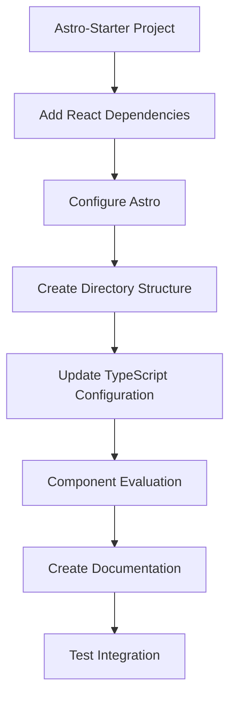
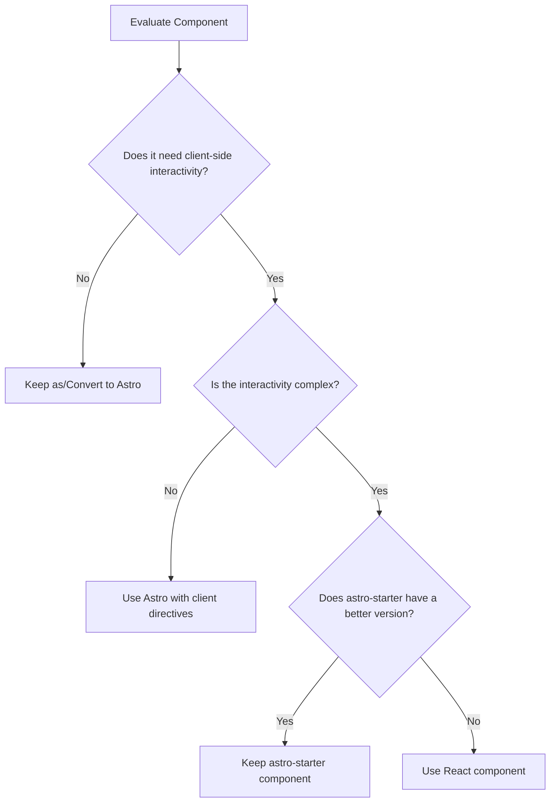

# React Integration Plan for astro-starter Project

## 1. Overview



## 2. Component Analysis Strategy

After comparing the main-theme React components with existing astro-starter components, it's clear we need a strategic approach rather than wholesale migration. The Navigation component is a perfect example:

- The astro-starter `Navigation.astro` component is more feature-rich than the React version
- It already implements advanced accessibility features (keyboard navigation, proper ARIA attributes) 
- It includes responsive design, dropdown menus, and dark mode toggle

Our approach should be component-by-component evaluation to determine the best strategy for each.

## 3. Component Migration Decision Framework

For each component, we'll evaluate:



### Decision criteria:

1. **Keep existing Astro component when**:
   - It has better accessibility features
   - It has more functionality
   - It integrates well with the existing design system

2. **Use React component when**:
   - It has complex client-side interactivity
   - It uses React-specific libraries or hooks
   - The component doesn't exist in astro-starter

3. **Convert React to Astro when**:
   - The component is mostly static
   - The interactivity is minimal and can be handled with simple JavaScript

## 4. Implementation Plan

### 4.1 Add React Dependencies

```bash
npm install @astrojs/react react react-dom
```

Package versions:
```json
{
  "dependencies": {
    "@astrojs/react": "^3.0.0",
    "react": "^18.2.0",
    "react-dom": "^18.2.0",
    "accessible-astro-components": "^4.1.0"
  }
}
```

### 4.2 Configure Astro for React Integration

Update `astro.config.mjs`:

```javascript
import { defineConfig } from 'astro/config'
import mdx from '@astrojs/mdx'
import tailwind from '@astrojs/tailwind'
import compress from 'astro-compress'
import icon from 'astro-icon'
import react from '@astrojs/react'

export default defineConfig({
  compressHTML: true,
  site: 'https://accessible-astro.netlify.app',
  integrations: [
    mdx(),
    icon(),
    tailwind({
      applyBaseStyles: false,
    }),
    compress(),
    react(), // Add React integration
  ],
  vite: {
    css: {
      preprocessorOptions: {
        scss: {
          logger: {
            warn: () => {},
          },
        },
      },
    },
  },
})
```

### 4.3 Create Directory Structure for React Components

```
src/
├── components/
│   ├── react/             # React components directory
│   │   ├── index.ts       # Exports for React components
```

### 4.4 Create TypeScript Configuration

Create a `tsconfig.json` file:

```json
{
  "extends": "astro/tsconfigs/strict",
  "compilerOptions": {
    "jsx": "react-jsx",
    "jsxImportSource": "react",
    "baseUrl": ".",
    "paths": {
      "@/*": ["src/*"]
    }
  },
  "include": ["src/**/*.ts", "src/**/*.tsx", "src/**/*.astro"]
}
```

Update `src/env.d.ts` to include React types:

```typescript
/// <reference path="../.astro/types.d.ts" />
/// <reference types="astro/client" />
/// <reference types="react" />
/// <reference types="react-dom" />
```

### 4.5 Component Evaluation

Based on our initial analysis of the Navigation component, here's our evaluation of main-theme components:

| Component      | Decision                           | Reasoning                                          |
|----------------|------------------------------------|----------------------------------------------------|
| Navigation     | Keep astro-starter version         | More features, better accessibility                |
| Hero           | Evaluate (likely keep Astro)       | Static content, no complex interactivity           |
| Footer         | Evaluate (likely keep Astro)       | Static content, no complex interactivity           |
| Blog components| Evaluate case-by-case              | May need React for complex interactive features    |
| Gallery        | Potential React candidate          | May benefit from React's state management          |
| Contact        | Potential React candidate          | Form handling may benefit from React               |

### 4.6 Create Test Component

For components that will use React, create a simple component structure:

```tsx
// src/components/react/TestComponent.tsx
import React from 'react';

interface TestComponentProps {
  title: string;
  description?: string;
}

export const TestComponent: React.FC<TestComponentProps> = ({ title, description }) => {
  return (
    <div className="test-component">
      <h2>{title}</h2>
      {description && <p>{description}</p>}
    </div>
  );
};
```

### 4.7 Using Astro Islands for React Components

For React components that need client-side interactivity, use Astro Islands with appropriate client directives:

```astro
---
import { ReactComponent } from '../components/react/ReactComponent';
---

<ReactComponent client:load />
```

Available client directives:
- `client:load` - Load and hydrate immediately
- `client:idle` - Load when browser is idle
- `client:visible` - Load when component is visible
- `client:media` - Load when media query matches
- `client:only` - Client-side rendering only

### 4.8 Documentation

Create documentation on React integration that covers:
- When to use React vs Astro components
- How to leverage Astro Islands for React components
- Accessibility requirements for all components
- How to maintain consistency between React and Astro components

## 5. Implementation Timeline

1. **Setup phase** (Dependencies & Configuration): ~1 hour
2. **Structure creation**: ~30 minutes
3. **Component evaluation and decisions**: ~2 hours
4. **Testing and validation**: ~1 hour

Total estimated time: ~4.5 hours